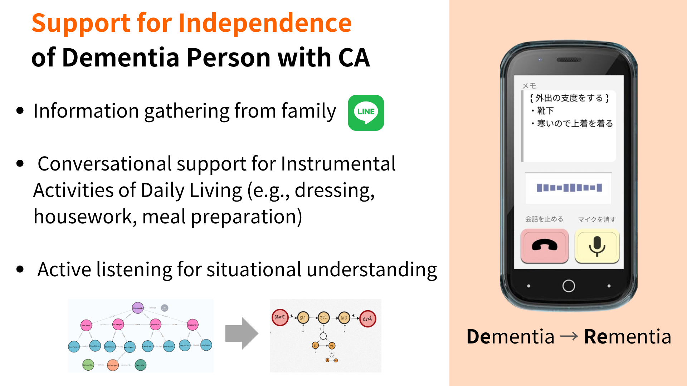

# Fast_And_Slow

A dual-process system that combines fast-responding client-side agents with server-side deep thinking agents. Through asynchronous reasoning and planning, it enables deep understanding-based control without interrupting user dialogue.



## System Overview

Fast_And_Slow is a System 2 component (referring to Kahneman's "Fast and Slow" thinking model) designed to support people with dementia through cognitive assistance. It connects to dialogue agents via WebSocket and acts as an intervention system that provides structured planning and reasoning.

The system autonomously collects information, builds knowledge graphs based on care ontology, and leverages the hierarchical structure to pace sequential execution. It adjusts granularity and implements a state machine for dementia-friendly step-by-step interactions.

A key feature is the UoT (Uncertainty of Thought-based) closed question generation, which helps understand the situation of people with dementia who have diminished language capabilities.

### Dual Process Architecture
1. **Fast Process (Client-side)**
   - Immediate user responses
   - Basic dialogue management
   - Local state management

2. **Slow Process (Server-side)**
   - Asynchronous deep reasoning
   - Situation understanding and question generation via LendingEarModule
   - Staged planning through Graph Instruction
   - State transition management and optimization

### Key Components

#### Server-side Reasoning Engine
- **LendingEarModule**
  - Context understanding from dialogue history
  - Adaptive question generation
  - Reasoning using knowledge graphs

- **State Management System**
  ```python
  class BackEndProcess:
      def __init__(self, socketio, room, client_data, db, kg_db):
          self.lending_ear_controller = None
          self.conversation_controller = None
          self.llm_client = ChatFireworks(...)
  ```

#### Communication Control
- Socket.IO-based bidirectional communication
- JWT authentication for secure connection management
- Asynchronous notifications using FCM

### State Transition and Control Flow

```mermaid
sequenceDiagram
    participant User
    participant Fast as Fast Process
    participant Slow as Slow Process
    participant KG as Knowledge Graph

    User->>Fast: User input
    Fast-->>User: Immediate response
    Fast->>Slow: Asynchronous processing request
    Fast->>User: 
    User->>Fast: User input

    ...

    Slow->>KG: Context analysis
    KG-->>Slow: Inference results
    Slow-->>Fast: Control instructions
    Fast-->>User: Optimized response
```

## Overview
Flask-based socket server with authentication functionality. It uses JWT (JSON Web Token) for API key issuance and handshake authentication, and manages authenticated user information in a PostgreSQL database.

## Prerequisites
- Python 3.9.16
- Flask
- PostgreSQL
- Firebase Authentication
- ngrok (for tunneling in development environments)

## Installation and Setup

### Step 1: Set up Python Environment
Install Python 3.9.16 using pyenv:
```bash
pyenv install 3.9.16
pyenv local 3.9.16
```

### Step 2: Create Virtual Environment
Create and activate a virtual environment in the project directory:
```bash
python -m venv .venv
source .venv/bin/activate  # For Unix-based systems
.venv\Scripts\activate     # For Windows
```

### Step 3: Install PostgreSQL
Download and install PostgreSQL from the official site, then create a database:
```sql
CREATE DATABASE rementia;
```

### Step 4: Set Environment Variables
Copy .env.example to .env and set the necessary environment variables:
- OPENAI_API_KEY
- FIREBASE_API_KEY
- DATABASE_URL
- Other required authentication information

### Step 5: Install Dependencies
```bash
pip install -r requirements.txt
```

### Step 6: Migrate Database
```bash
flask db init
flask db migrate -m "initial migration"
flask db upgrade
```

### Step 7: Set up ngrok Tunneling
Configure ngrok to make the application accessible externally in the development environment:
```bash
ngrok http --domain=<your-domain> 8080
```

### Step 8: Start the Application
```bash
python app.py
```

## Authentication Flow

1. Access the `/login` endpoint to log in
2. Create a user and obtain an API key via `/create_user`
   - Store the obtained API key securely (e.g., in Android app secrets)

## Notification Functionality

Notification system implemented using FCM (Firebase Cloud Messaging):
- Access the notification management console at `/fcm/console`
- Send notifications to individual users or all users

## Using WebSocket (Socket.IO)

Real-time communication is possible using Socket.IO:

```javascript
// Client-side implementation example
const socket = io('http://your-server:8080', {
  auth: {
    token: 'your-jwt-token'
  }
});

socket.on('connect', () => {
  console.log('Connection successful');
});

socket.on('message', (data) => {
  console.log('Message received:', data);
});
```

## Security Considerations
- Always store API keys securely
- Use appropriate SSL/TLS certificates in production environments
- Manage environment variables properly and avoid committing them to public repositories

## Troubleshooting
- If you encounter database connection errors, check the DATABASE_URL format
- For Firebase authentication errors, verify the accuracy of your authentication information
- For Socket.IO connection errors, check CORS and port settings

If you have any questions, please create an issue.

## Socket.IO Event Handlers and Client Communication

### Basic Communication Flow

1. Authentication Flow
```javascript
// 1. Obtain a JWT token using the API key
POST /api/token
Header: {
    'API-Key': 'your-api-key'
}

// 2. Connect to Socket.IO with the obtained token
const socket = io('http://your-server:8080', {
    query: { token: 'your-jwt-token' }
});
```

### Main Event Handlers

1. Send Chat Messages
```javascript
// Client-side
socket.emit('chat_message', {
    role: "user",
    content: "Message content"
});

// Receive responses from the server
socket.on('message', (data) => {
    console.log('Received message:', data);
});
```

2. Mode Switching
```javascript
// Start Listening Mode
socket.emit('start_lending_ear');

// Start Instruction Mode
socket.emit('start_instruction');
```

3. State Transition Control
```javascript
// Proceed to the next state
socket.emit('go_next_state');

// Move to detailed view
socket.emit('go_detail');

// Return to the starting state
socket.emit('back_to_start');
```

### FCM (Firebase Cloud Messaging) Notifications

1. Register FCM Token
```javascript
POST /api/fcm/token_register
Headers: {
    'API-Key': 'your-api-key',
    'FCM-Token': 'your-fcm-token'
}
```

2. Receive Notifications
```kotlin
// Android client-side
class MyFirebaseMessagingService : FirebaseMessagingService() {
    override fun onMessageReceived(remoteMessage: RemoteMessage) {
        val notifyDisplayInfo = remoteMessage.data["notifyDisplayInfo"]
        val notifyDetail = remoteMessage.data["notifyDetail"]
        val notifySpeechReading = remoteMessage.data["notifySpeechReading"]
        
        // Notification display processing
    }
}
```

### Error Handling

1. Connection Errors
```javascript
socket.on('connect_error', (error) => {
    console.error('Connection error:', error);
});
```

2. Authentication Errors
```javascript
socket.on('error', (error) => {
    if (error.message === 'Invalid token') {
        // Token re-acquisition process
    }
});
```

### Disconnection Processing
```javascript
// Client-side disconnection
socket.disconnect();

// Reconnection
socket.connect();
```

### Notes

- WebSocket connections are maintained even in the background
- Automatic reconnection attempts occur after periods of inactivity
- Always update and register FCM tokens when the app starts
- Message sending and receiving are asynchronous, and order is not guaranteed

### Debugging and Troubleshooting

1. Verify WebSocket Connections
```bash
# Check connection status in server logs
tail -f server.log | grep "socket"
```

2. Test FCM Notifications
- Access the `/fcm/console` endpoint to send test notifications
- Using a physical device is recommended for testing notifications in the development environment

## Directory Structure
```
.
├── app.py                # Main application file
├── requirements.txt      # Python dependencies
├── .env.example          # Example environment variables
├── neo4j_modules/        # Neo4j knowledge graph modules
│   └── care_kg_db.py     # Care knowledge graph database
├── planning_modules/     # Planning and reasoning modules
│   ├── lending_ear_modules/  # Modules for listening and understanding
│   │   └── uot_modules/  # Uncertainty of Thought modules
│   └── state_machine_modules/ # State machine for interaction control
├── src/                  # Source files
│   └── img/              # Images including demo.png
└── utils/                # Utility functions
    └── backend_process.py # Backend processing logic
```

## Quick Start Guide

1. Clone the repository
2. Set up the environment as described in the Installation section
3. Start the application
4. Access the `/login` endpoint to log in
5. Create a user and obtain an API key
6. Use the API key in your client application for authentication

## References

- [UoT (Uncertainty of Thought) Framework](https://github.com/zhiyuanhubj/UoT)

## Version
v0.1.3
